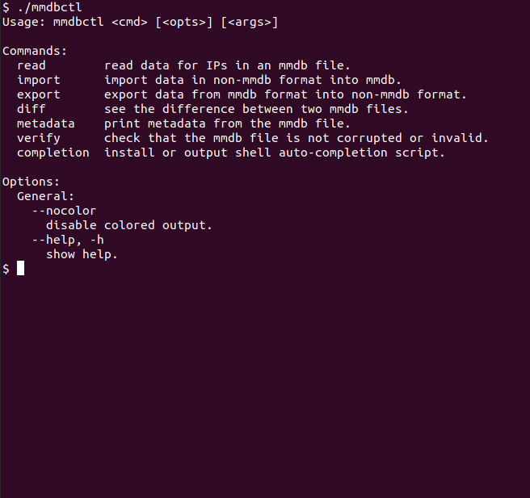

# [](https://ipinfo.io/) IPinfo `mmdbctl`

`mmdbctl` is an MMDB file management CLI by [IPinfo.io](https://ipinfo.io) that provides you
the following features:

- Read data for IPs in an MMDB file.
- Import data in non-MMDB format into MMDB.
- Export data from MMDB format into non-MMDB format.
- See the difference between two MMDB files.
- Print the metadata of an MMDB file.
- Check that an MMDB file is not corrupted or invalid.

## Installation

The `mmdbctl` CLI is available for download via multiple mechanisms.

### macOS

Install the latest `amd64` version:

```bash
curl -Ls https://github.com/ipinfo/mmdbctl/releases/download/mmdbctl-1.4.0/macos.sh | sh
```

### Debian / Ubuntu (amd64)

```bash
curl -Ls https://github.com/ipinfo/mmdbctl/releases/download/mmdbctl-1.4.0/deb.sh | sh
```

OR

```bash
curl -LO https://github.com/ipinfo/mmdbctl/releases/download/mmdbctl-1.4.0/mmdbctl_1.4.0.deb
sudo dpkg -i mmdbctl_1.4.0.deb
```

### Windows Powershell

_Note_: run powershell as administrator before executing this command.

```bash
iwr -useb https://github.com/ipinfo/mmdbctl/releases/download/mmdbctl-1.4.0/windows.ps1 | iex
```

### Using `go install`

Make sure that `$GOPATH/bin` is in your `$PATH`, because that's where this gets
installed:

```bash
go install github.com/ipinfo/mmdbctl@latest
```

### Using `curl`/`wget`

The pre-built binaries for all platforms are available on GitHub via artifacts
in releases. You need to simply download, unpack and move them to your shell's
binary search path.

The following OS & arch combinations are supported (if you use one not listed
on here, please open an issue):

```
darwin_amd64
darwin_arm64
dragonfly_amd64
freebsd_386
freebsd_amd64
freebsd_arm
freebsd_arm64
linux_386
linux_amd64
linux_arm
linux_arm64
netbsd_386
netbsd_amd64
netbsd_arm
netbsd_arm64
openbsd_386
openbsd_amd64
openbsd_arm
openbsd_arm64
solaris_amd64
windows_386
windows_amd64
windows_arm
```

After choosing a platform `PLAT` from above, run:

```bash
# for Windows, use ".zip" instead of ".tar.gz"
curl -LO https://github.com/ipinfo/mmdbctl/releases/download/mmdbctl-1.4.0/mmdbctl_1.4.0_${PLAT}.tar.gz
# OR
wget https://github.com/ipinfo/mmdbctl/releases/download/mmdbctl-1.4.0/mmdbctl_1.4.0_${PLAT}.tar.gz
tar -xvf mmdbctl_1.4.0_${PLAT}.tar.gz
mv mmdbctl_1.4.0_${PLAT} /usr/local/bin/mmdbctl
```

### Using `git`

Installing from source requires at least the Golang version specified in
`go.mod`. You can install the Golang toolchain from
[the official site](https://golang.org/doc/install).

Once the correct Golang version is installed, simply clone the repository and
install the binary:

```bash
git clone https://github.com/ipinfo/mmdbctl
cd mmdbctl
go install .
$GOPATH/bin/mmdbctl
```

You can add `$GOPATH/bin` to your `$PATH` to access `mmdbctl` directly from
anywhere.

Alternatively, you can do the following to output the binary somewhere
specific:

```bash
git clone https://github.com/ipinfo/mmdbctl
cd mmdbctl
go build -o <path> .
```

Replace `<path>` with the required location.

## Quick Start

This will help you quickly get started with the `mmdbctl` CLI.

### Default Help Message

By default, invoking the CLI shows a help message:



### Reading

You can read from MMDB files in various different ways - as individual IPs,
CIDRs or IP ranges, coming from the command line as arguments, or from files,
or from stdin.

Pretty JSON format:

```bash
$ mmdbctl read -f json-pretty 8.8.8.8 location.mmdb
{
  "city": "Mountain View",
  "country": "US",
  "geoname_id": "5375480",
  "latitude": "37.4056",
  "longitude": "-122.0775",
  "postalcode": "94043",
  "region": "California",
  "timezone": "America/Los_Angeles"
}
```

CSV format:

```bash
$ mmdbctl read -f csv 8.8.8.8 location.mmdb
ip,city,country,geoname_id,latitude,longitude,postalcode,region,timezone
8.8.8.8,Mountain View,US,5375480,37.4056,-122.0775,94043,California,America/Los_Angeles
```

TSV format:

```bash
$ mmdbctl read -f tsv 8.8.8.8 location.mmdb
ip	city	country	geoname_id	latitude	longitude	postalcode	region	timezone
8.8.8.8	Mountain View	US	5375480	37.4056	-122.0775	94043	California	America/Los_Angeles
```

Via a file:

```bash
$ cat ips.txt
8.8.8.8
8.8.8.0/31
8.8.8.0-8.8.8.1
8.8.8.0,8.8.8.1

$ mmdbctl read ips.txt location.mmdb | sort -u
{"city":"Mountain View","country":"US","geoname_id":"5375480","latitude":"37.4056","longitude":"-122.0775","postalcode":"94043","region":"California","timezone":"America/Los_Angeles"}
```

Via stdin:

```bash
$ echo 8.8.8.8 | mmdbctl read location.mmdb
{"city":"Mountain View","country":"US","geoname_id":"5375480","latitude":"37.4056","longitude":"-122.0775","postalcode":"94043","region":"California","timezone":"America/Los_Angeles"}
```

Multiple inputs are also possible - these all return the same thing:

```bash
$ echo -e '8.8.8.8\n1.2.3.4' | mmdbctl read location.mmdb
$ mmdbctl read 8.8.8.8 1.2.3.4 location.mmdb
{"city":"Mountain View","country":"US","geoname_id":"5375480","latitude":"37.4056","longitude":"-122.0775","postalcode":"94043","region":"California","timezone":"America/Los_Angeles"}
{"city":"Brisbane","country":"AU","geoname_id":"2174003","latitude":"-27.48203","longitude":"153.01358","postalcode":"4101","region":"Queensland","timezone":"Australia/Brisbane"}
```

Can check CIDRs and ranges - these will all return the same thing:

```bash
$ mmdbctl read 8.8.8.0/31 location.mmdb
$ mmdbctl read 8.8.8.0-8.8.8.1 location.mmdb
$ mmdbctl read 8.8.8.0,8.8.8.1 location.mmdb
{"city":"Mountain View","country":"US","geoname_id":"5375480","latitude":"37.4056","longitude":"-122.0775","postalcode":"94043","region":"California","timezone":"America/Los_Angeles"}
{"city":"Mountain View","country":"US","geoname_id":"5375480","latitude":"37.4056","longitude":"-122.0775","postalcode":"94043","region":"California","timezone":"America/Los_Angeles"}
{"city":"Mountain View","country":"US","geoname_id":"5375480","latitude":"37.4056","longitude":"-122.0775","postalcode":"94043","region":"California","timezone":"America/Los_Angeles"}
```

### Importing

Importing allows taking in files as CSV/TSV/JSON, and outputting an MMDB file.

Importing is one of the most powerful/flexible features in `mmdbctl`. However,
we only allow strings throughout the data at the current time.

See `mmdbctl import --help` for full details on usage.

Here are some basic examples:

```bash
# basic CSV importing into MMDB.
$ mmdbctl import --in data.csv --out data.mmdb

# generate MMDB from a TSV file containing IPv4 data.
$ cat data.tsv | mmdbctl import --ip 4 --tsv --out data.mmdb

# don't include the implicit `network` field in the output MMDB:
$ mmdbctl import --no-network --in data.csv --out data.mmdb

# generate an MMDB without any fields, just IP ranges that meet a criteria.
$ mmdbctl import                                                              \
    --size 24 --no-fields --ip 4                                              \
    --in anycast.csv --out anycast.mmdb
```

### Exporting

Exporting allows taking in an MMDB file and outputting CSV/TSV/JSON.

See `mmdbctl export --help` for full details on usage.

```bash
# basic export.
$ mmdbctl export data.mmdb data.csv

# basic export without a header.
$ mmdbctl export --no-header data.mmdb data.csv

# just see the number of entries it'd output.
$ mmdbctl export --no-header --format csv data.mmdb | wc -l
```

### Metadata

You can retrieve data in the `metadata` section of the MMDB file using the
`metadata` subcommand.

Pretty format:

```bash
$ mmdbctl metadata location.mmdb
- Binary Format 2.0
- Database Type ipinfo location.mmdb
- IP Version    4
- Record Size   32
- Node Count    123456789
- Description
    en ipinfo location.mmdb
- Languages     en
- Build Epoch   123456789
```

JSON format:

```bash
$ mmdbctl metadata -f json location.mmdb
{
    "binary_format": "2.0",
    "db_type": "ipinfo location.mmdb",
    "ip": 4,
    "record_size": 32,
    "node_count": 123456789,
    "description": {
        "en": "ipinfo location.mmdb"
    },
    "languages": [
        "en"
    ],
    "build_epoch": 123456789
}
```

### Verification

You can verify if a MMDB file is correctly structured with the `verify`
subcommand:

```bash
$ mmdbctl verify location.mmdb
valid
```

Let's force it to be invalid and check again:

```bash
$ cp location.mmdb location-tmp.mmdb
$ cat location.mmdb >> location-tmp.mmdb
$ mmdbctl verify location-tmp.mmdb
invalid: received decoding error (the MaxMind DB file's data section contains bad data (uint16 size of 11)) at offset of 13825601
```

## Auto-Completion

Auto-completion is supported for at least the following shells:

```
bash
zsh
fish
```

NOTE: it may work for other shells as well because the implementation is in
Golang and is not necessarily shell-specific.

### Installation

Installing auto-completions is as simple as running one command (works for
`bash`, `zsh` and `fish` shells):

```bash
mmdbctl completion install
```

If you want to customize the installation process (e.g. in case the
auto-installation doesn't work as expected), you can request the actual
completion script for each shell:

```bash
# get bash completion script
mmdbctl completion bash

# get zsh completion script
mmdbctl completion zsh

# get fish completion script
mmdbctl completion fish
```

### Shell not listed?

If your shell is not listed here, you can open an issue.

Note that as long as the `COMP_LINE` environment variable is provided to the
binary itself, it will output completion results. So if your shell provides a
way to pass `COMP_LINE` on auto-completion attempts to a binary, then have your
shell do that with the `mmdbctl` binary itself (or any of our binaries).

## Color Output

### Disabling Color Output

All our CLIs respect either the `--nocolor` flag or the
[`NO_COLOR`](https://no-color.org/) environment variable to disable color
output.

### Color on Windows

To enable color support for the Windows command prompt, run the following to
enable [`Console Virtual Terminal Sequences`](https://docs.microsoft.com/en-us/windows/console/console-virtual-terminal-sequences).

```cmd
REG ADD HKCU\CONSOLE /f /v VirtualTerminalLevel /t REG_DWORD /d 1
```

You can disable this by running the following:

```cmd
REG DELETE HKCU\CONSOLE /f /v VirtualTerminalLevel
```

## Other IPinfo Tools

There are official IPinfo client libraries available for many languages including PHP, Python, Go, Java, Ruby, and many popular frameworks such as Django, Rails and Laravel. There are also many third party libraries and integrations available for our API.

See [https://ipinfo.io/developers/libraries](https://ipinfo.io/developers/libraries) for more details.

## About IPinfo

Founded in 2013, IPinfo prides itself on being the most reliable, accurate, and in-depth source of IP address data available anywhere. We process terabytes of data to produce our custom IP geolocation, company, carrier, VPN detection, hosted domains, and IP type data sets. Our API handles over 40 billion requests a month for businesses and developers.

[](https://ipinfo.io/)
